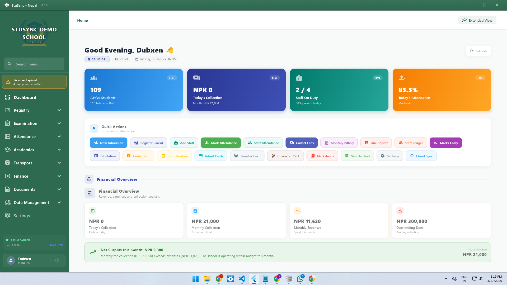
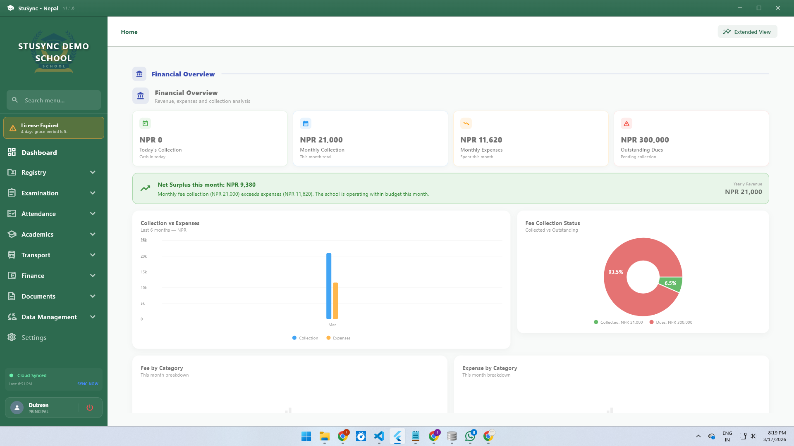
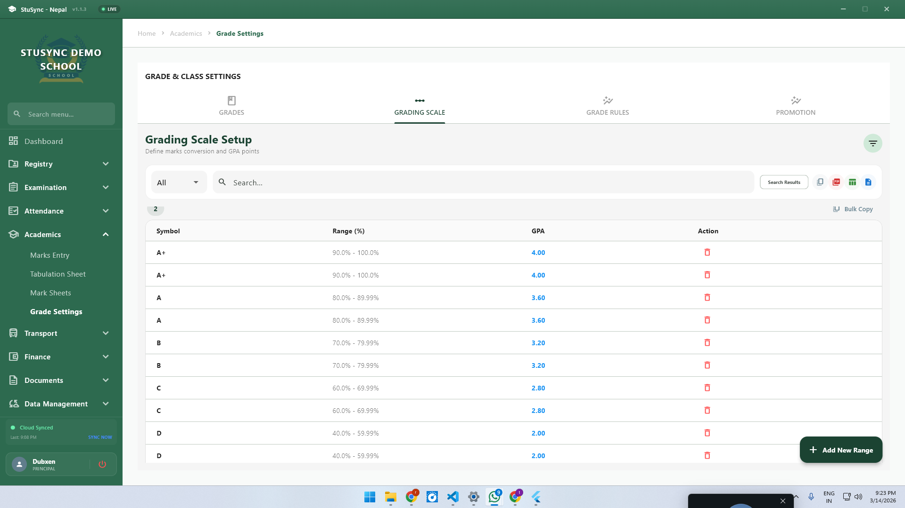
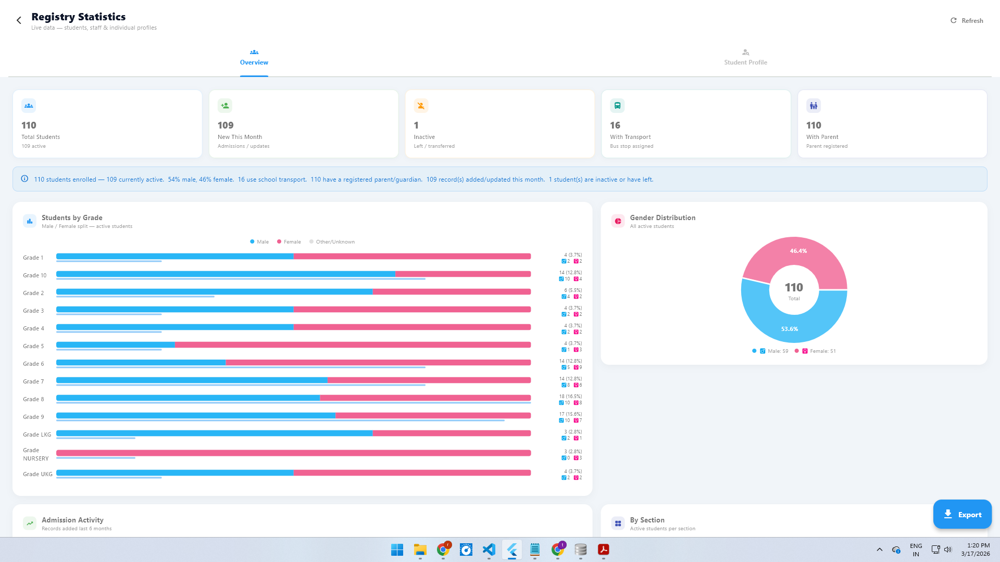
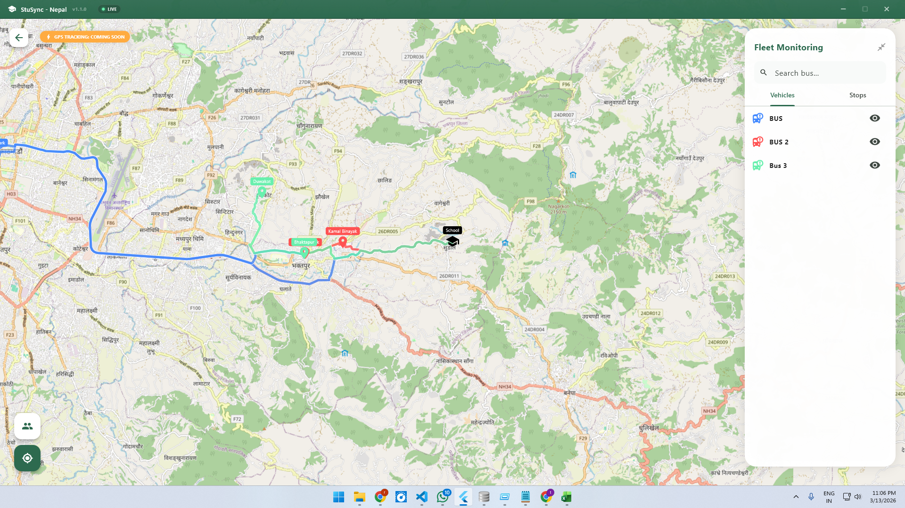
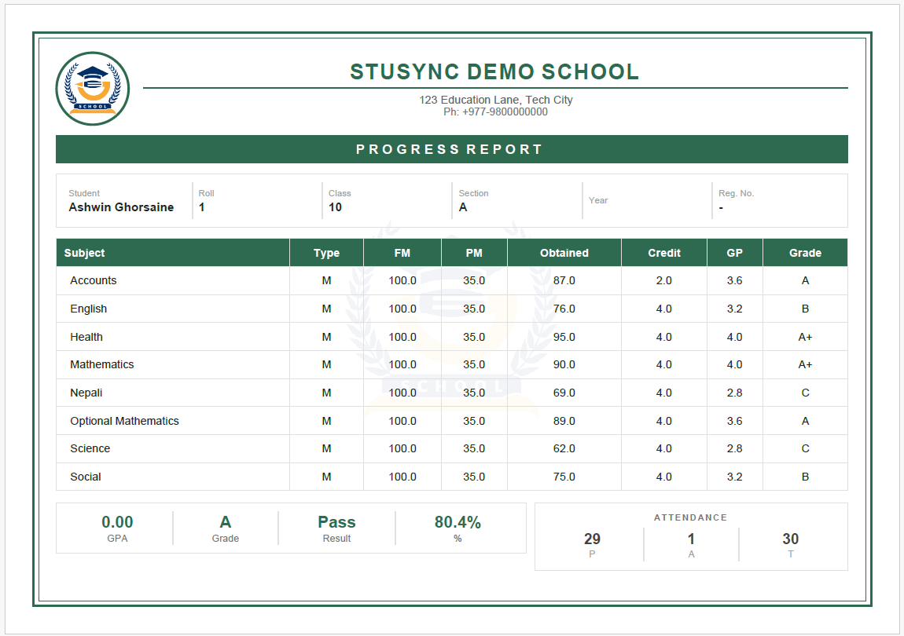

<div align="center">


# StuSync

**Offline-First School Management for Windows**

[](https://github.com/Trehive/stusync-patches/releases/latest)
[](https://github.com/Trehive/stusync-patches/releases/latest)
[](mailto:trehiveofficial@gmail.com)

*From student admissions to fee collection, staff tracking, and live campus monitoring — all in one app, even without internet.*

</div>

---

> [!IMPORTANT]
> **Enterprise License Required**
> StuSync requires a **Hardware-Linked License Key** and verified administrator credentials.
> Contact **[trehiveofficial@gmail.com](mailto:trehiveofficial@gmail.com)** or visit **[stusync.trehive.com](https://stusync.trehive.com)** to get started.

---

## What is StuSync?

StuSync is a desktop school management system built for real schools — small or large. It works **fully offline**, syncs to the cloud when connected, and handles every corner of school operations in one place.

> **No internet? Still works.** Data stays local, syncs automatically when you're back online.

### Core Modules

| Module | What it does |
|--------|-------------|
| 🎓 **Registry** | Student & staff profiles, admissions, transfers |
| 📚 **Academics** | Subjects, grading scales, marks entry, report cards |
| 💰 **Finance** | Fee billing, invoicing, expense tracking, due reports |
| 📡 **Cloud Sync** | Multi-device sync with conflict resolution (Supabase) |
| 🚌 **Transport** | Bus routes, stop management, fleet monitoring |
| 🔒 **Licensing** | Hardware-linked keys, device registry security |
| 📷 **CCTV** | Live feed integration, secondary dashboard |

---

## Screenshots

### Dashboard

*Live stats — active students, today's collections, staff on duty, and attendance at a glance.*

### Financial Overview

*Monthly collection vs expenses, fee collection status, and category breakdowns.*

### Registry Statistics

*Student distribution by grade and gender, admission activity, section breakdown.*

### Progress Reports

*Auto-generated marksheets with GPA, grade, attendance, and principal signature.*

### Transport & Fleet

*Route visualization and fleet monitoring across all school buses.*

### Grade & Class Settings

*Grading scale setup — define GPA ranges, symbols, and bulk-manage entries.*

---

## Current Release

### v1.2.5+17 — Security & Stability

> Critical security enhancements to parent and staff portals, plus performance improvements across the platform.

| Property | Value |
|----------|-------|
| Version | `v1.2.5+17` |
| Platform | Windows (Desktop) |
| Database Schema | `v4` |
| Release Date | April 2026 |

**Highlights**
- 🔐 Supabase RLS overhaul — all sensitive tables now use secure RPC functions
- 🔑 Parent & staff portals: no more anonymous data access
- 🗄️ SQLCipher DLL fully bundled — encrypted DB works across all Windows machines
- 📊 Bulk import system with preview dialog and validation
- ✍️ Principal auto-signature on all generated reports
- 🔄 Improved sync conflict resolution for multi-device scenarios

[→ View Full Release Notes](https://github.com/Trehive/stusync-patches/releases/latest)

---

## Release History

| Version | Highlights |
|---------|-----------|
| `v1.2.5+17` | Security overhaul, RLS policies, bulk import, auto-signature |
| `v1.1.5+10` | Staff assignment, subject ordering, bulk class operations, sync hardening |
| `v1.1.4+9` | Unique constraints, duplicate prevention, smart sync |
| `v1.1.0+5` | CCTV integration, hardware licensing, secondary dashboard |

---

## Installation

### Fresh Install

1. Download `stusync_v1.2.5+17.zip` from [Releases](https://github.com/Trehive/stusync-patches/releases/latest)
2. Extract to your preferred folder
3. Run `stusync.exe`
4. Enter your **Institution License Key** on first launch
5. Log in with administrator credentials

### Upgrading

1. Download `update.patch` from [Releases](https://github.com/Trehive/stusync-patches/releases/latest)
2. Run `updater.exe` — patch applies automatically
3. The app will auto-migrate the database on first launch
4. Run a **Full Sync** after upgrading

> [!WARNING]
> Back up your database before upgrading. The app will prompt you, but manual backups are recommended for large deployments.

---

## For Trehive Team — Publishing an Update

1. Generate `update.patch` by diffing the new build against the previous one

2. Update `version.json`:
```json
{
  "latest_version": "1.2.5+17",
  "changelog": "Security overhaul, RLS policies, bulk import",
  "patch_url": "https://github.com/Trehive/stusync-patches/releases/latest/download/update.patch"
}
```

3. Draft a new GitHub Release:
   - Tag: `v1.2.5+17`
   - Attach `update.patch` and `updater.exe`
   - Paste release notes and publish

---

## Direct Links

| Resource | URL |
|----------|-----|
| Version Check | `https://raw.githubusercontent.com/Trehive/stusync-patches/main/version.json` |
| Latest Patch | `.../releases/latest/download/update.patch` |
| Latest Installer | `.../releases/latest/download/updater.exe` |

---

## Contact & Licensing

| Channel | Details |
|---------|---------|
| 📧 Email | [trehiveofficial@gmail.com](mailto:trehiveofficial@gmail.com) |
| 🌐 Website | [stusync.trehive.com](https://stusync.trehive.com) |
| 🐛 Issues | [Open an issue](https://github.com/Trehive/stusync-patches/issues) |

---

<div align="center">
<sub>© 2024–2026 Trehive · StuSync is proprietary software · All rights reserved · All assets, screenshots, and branding are property of Trehive</sub>
</div>