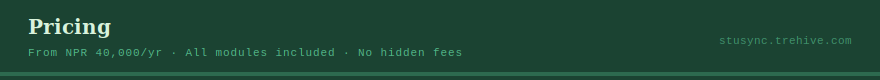

[← Back to README](../README.md) · [Features](./FEATURES.md) · [Installation](./INSTALL.md)

---

## Plans

All tiers include every module — finance, registry, academics, payroll, transport, CCTV, cloud sync, and security. No per-module charges. No surprises.

| Tier | School Size | Annual Investment |
|------|-------------|-------------------|
| **Starter** | Up to 499 students | NPR 40,000 / year |
| **Growth** | 500 – 799 students | NPR 50,000 / year |
| **Professional** | 800 – 1,199 students | NPR 60,000 / year |
| **Enterprise** | 1,200+ students | Custom — contact Trehive |

---

## What's Included in Every Plan

- ✅ All 10+ modules — no per-module charges
- ✅ Offline-first architecture — works without internet
- ✅ AES-256 SQLCipher encryption
- ✅ Cloud sync via Supabase
- ✅ Silent over-the-air auto-updates
- ✅ All 9 certificate templates
- ✅ Encrypted backup system
- ✅ Email & phone support

---

## Support by Tier

| Tier | Support |
|------|---------|
| Starter | Email + phone (business hours) |
| Growth | Email + phone (extended hours) |
| Professional | Priority email, phone, and WhatsApp |
| Enterprise | Dedicated account manager |

---

## Enterprise

For institutions with 1,200+ students or special requirements:

- **Dedicated onboarding** — full guided setup
- **Custom branding** — your school logo inside the app
- **Multi-school dashboard** — centralized management across campuses
- **Priority feature access** — early access to new modules
- **SLA guarantee** — committed response and resolution times
- **Custom integrations** — on request

Contact [trehiveofficial@gmail.com](mailto:trehiveofficial@gmail.com) for a custom quote.

---

## How to Purchase

1. **Enquire** — email or call Trehive to get started
2. **Demo** — request a free guided walkthrough of the platform
3. **Select plan** — choose the tier that matches your enrollment
4. **Payment** — bank transfer or cash
5. **Activate** — receive your license key by email and go live

---

## Renewals & Upgrades

- Licenses renew **annually**
- Renewal reminder sent **30 days before expiry**
- Early renewal within 30 days **locks in current pricing**
- **Upgrades** take effect immediately from the next billing cycle
- **Downgrades** are processed at the end of the current period
- **Cancellation** — access continues to end of paid period, no refunds for unused time

---

## Contact

| Channel | Details |
|---------|---------|
| Email | [trehiveofficial@gmail.com](mailto:trehiveofficial@gmail.com) |
| Phone | +977-9741802381 · +977-9808320338 |
| Website | [stusync.trehive.com](https://stusync.trehive.com) |
| Address | New Baneshwor, Kathmandu, Nepal |

---

[← Back to README](../README.md) · [Installation →](./INSTALL.md)

*© 2024–2026 Trehive*

